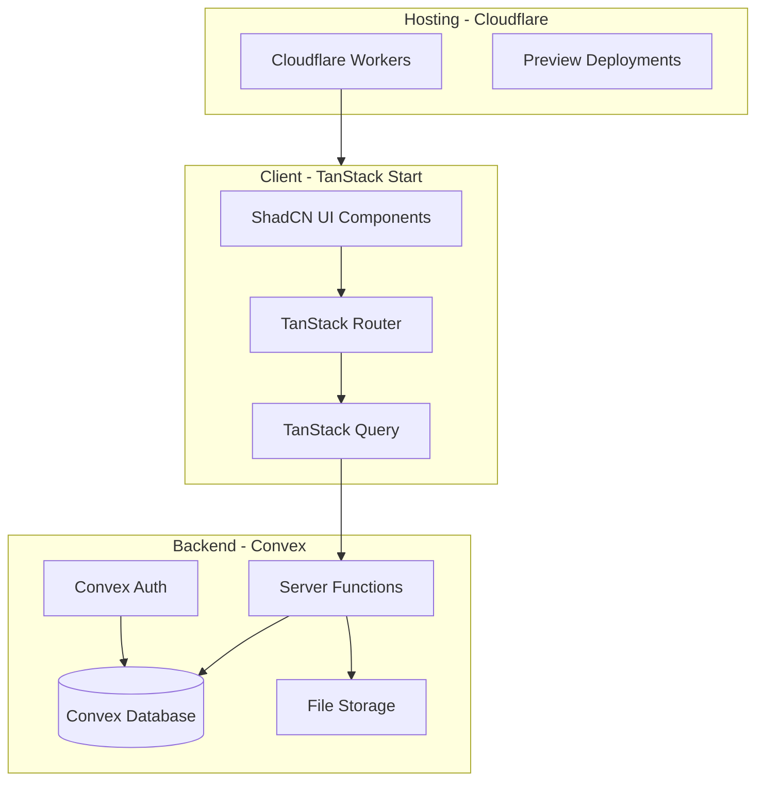

# Expense Manager Project Plan

## Architecture Overview



## Tech Stack Summary

- **Package Manager**: pnpm
- **Framework**: TanStack Start (React meta-framework)
- **Database/Auth**: Convex with Convex Auth (email + password)
- **UI**: ShadCN UI with custom Nova preset
- **Hosting**: Cloudflare Workers
- **Testing**: Vitest (browser mode) + Playwright (E2E) + Visual Regression (Docker)

---

## Phase 1: Project Scaffolding

### 1.1 Initialize TanStack Start Project

```bash
pnpm create @tanstack/start@latest expense-manager
cd expense-manager
```

### 1.2 Install Core Dependencies

```bash
# Convex + TanStack Query integration
pnpm add convex @convex-dev/react-query @tanstack/react-router-with-query @tanstack/react-query

# Convex Auth
pnpm add @convex-dev/auth @auth/core

# Cloudflare deployment
pnpm add -D @cloudflare/vite-plugin wrangler

# Form handling
pnpm add @tanstack/react-form zod
```

### 1.3 Install ShadCN UI

```bash
pnpm dlx shadcn@latest create --preset "https://ui.shadcn.com/init?base=base&style=nova&baseColor=neutral&theme=blue&iconLibrary=hugeicons&font=noto-sans&menuAccent=subtle&menuColor=default&radius=default&template=start" --template start
```

### 1.4 Configure Cloudflare

Create `wrangler.jsonc`:

```json
{
  "$schema": "node_modules/wrangler/config-schema.json",
  "name": "expense-manager",
  "compatibility_date": "2025-01-27",
  "compatibility_flags": ["nodejs_compat"],
  "main": "@tanstack/react-start/server-entry"
}
```

Update `vite.config.ts` to include Cloudflare plugin:

```typescript
import { cloudflare } from '@cloudflare/vite-plugin'
import { tanstackStart } from '@tanstack/react-start/plugin/vite'
// ... add cloudflare({ viteEnvironment: { name: 'ssr' } }) to plugins
```

---

## Phase 2: Database Schema (Convex)

### 2.1 Schema Design

File: `convex/schema.ts`

```typescript
import { defineSchema, defineTable } from "convex/server";
import { v } from "convex/values";
import { authTables } from "@convex-dev/auth/server";

export default defineSchema({
  ...authTables,

  expenses: defineTable({
    userId: v.id("users"),
    date: v.string(),           // ISO date string
    merchant: v.string(),
    amount: v.number(),         // cents to avoid floating point issues
    categoryId: v.id("categories"),
    attachmentId: v.optional(v.id("_storage")),
    comment: v.optional(v.string()),
    createdAt: v.number(),
  })
    .index("by_user", ["userId"])
    .index("by_user_and_date", ["userId", "date"]),

  categories: defineTable({
    name: v.string(),
    userId: v.optional(v.id("users")), // null = predefined, set = user custom
    icon: v.optional(v.string()),
  })
    .index("by_user", ["userId"]),
});
```

### 2.2 Predefined Categories (Seed Data)

Create `convex/seed.ts` with categories:

- Food & Dining
- Transportation
- Utilities
- Entertainment
- Shopping
- Healthcare
- Travel
- Other

---

## Phase 3: Authentication Setup

### 3.1 Convex Auth Configuration

File: `convex/auth.ts`

- Configure email + password provider
- Set up password reset flow
- Email verification (optional for MVP)

### 3.2 Auth UI Components

- `components/auth/SignUpForm.tsx` - Registration form
- `components/auth/SignInForm.tsx` - Login form
- `components/auth/AuthLayout.tsx` - Shared auth page layout

---

## Phase 4: Application Routes

### Route Structure

```
app/routes/
├── __root.tsx              # Root layout with Convex/Query providers
├── index.tsx               # Public landing page
├── _auth.tsx               # Auth layout (for sign-in/sign-up)
│   ├── sign-in.tsx         # Login page
│   └── sign-up.tsx         # Registration page
├── _authenticated.tsx      # Protected layout (requires auth)
│   ├── dashboard.tsx       # Expense list/table
│   ├── expenses/
│   │   ├── new.tsx         # Add expense
│   │   └── $expenseId.tsx  # Edit expense
│   └── reports.tsx         # Monthly reports page
```

---

## Phase 5: Core Features

### 5.1 Dashboard (Expense List)

- TanStack Table for sortable, filterable expense list
- Sorted by date (most recent first)
- Columns: Date, Merchant, Category, Amount, Attachment indicator
- Click row to navigate to edit page
- "Add Expense" button

### 5.2 Expense Form (Add/Edit)

Shared component for creating and editing expenses:

- Date picker
- Merchant text input
- Amount input (currency formatted)
- Category dropdown (predefined + custom)
- File upload for attachment (image/PDF)
- Optional comment textarea
- Delete button (edit mode only)

### 5.3 Reports Page

- Month selector
- **CSV Export**: Group expenses by day and category
- **ZIP Download**: All attachments for selected month
- Summary stats (total spent, by category breakdown)

### 5.4 Category Management

- Inline category creation in expense form
- Categories dropdown shows predefined + user's custom categories

---

## Phase 6: Convex Functions

### Queries

- `expenses.list` - Get user's expenses (paginated, sorted)
- `expenses.get` - Get single expense by ID
- `categories.list` - Get predefined + user categories
- `reports.monthlyData` - Get expenses for a specific month

### Mutations

- `expenses.create` - Create expense
- `expenses.update` - Update expense
- `expenses.delete` - Delete expense
- `categories.create` - Create custom category

### File Storage

- `storage.generateUploadUrl` - Get upload URL for attachments
- `storage.getUrl` - Get download URL for attachments

---

## Phase 7: Testing Setup

### 7.1 Vitest Configuration

File: `vitest.config.ts`

```typescript
import { defineConfig } from 'vitest/config'

export default defineConfig({
  test: {
    include: ['src/**/*.test.{ts,tsx}'],
    browser: {
      enabled: true,
      provider: 'playwright',
      instances: [{ browser: 'chromium' }],
    },
  },
})
```

### 7.2 Playwright E2E Configuration

File: `playwright.config.ts`

```typescript
import { defineConfig, devices } from '@playwright/test'

export default defineConfig({
  testDir: './e2e',
  webServer: {
    command: 'pnpm run dev',
    port: 3000,
    reuseExistingServer: !process.env.CI,
  },
  projects: [
    { name: 'chromium', use: { ...devices['Desktop Chrome'] } },
  ],
})
```

### 7.3 Visual Regression with Docker

File: `docker-compose.test.yml`

```yaml
services:
  visual-tests:
    image: mcr.microsoft.com/playwright:v1.48.0-jammy
    working_dir: /app
    volumes:
      - .:/app
    command: pnpm run test:visual
```

### 7.4 Test Categories

| Type | Tool | Location | What to Test |

|------|------|----------|--------------|

| Unit | Vitest | `src/**/*.test.ts` | Utility functions, hooks |

| Integration | Vitest Browser | `src/**/*.test.tsx` | Component interactions |

| E2E | Playwright | `e2e/*.spec.ts` | Full user flows |

| Visual | Vitest Browser | `tests/visual/*.test.ts` | Key page screenshots |

### 7.5 Key Tests to Implement

**E2E Tests:**

- Sign up flow
- Sign in flow
- Add expense flow
- Edit expense flow
- Delete expense
- Generate CSV report
- Download attachments ZIP

**Visual Regression (key pages):**

- Landing page
- Sign in page
- Dashboard (empty state)
- Dashboard (with data)
- Expense form
- Reports page

---

## Phase 8: CI/CD with GitHub Actions

### 8.1 Test Workflow

File: `.github/workflows/test.yml`

```yaml
name: Test
on: [push, pull_request]

jobs:
  test:
    runs-on: ubuntu-latest
    steps:
      - uses: actions/checkout@v4
      - uses: pnpm/action-setup@v4
      - uses: actions/setup-node@v4
        with:
          node-version: 20
          cache: 'pnpm'
      - run: pnpm install
      - run: npx playwright install --with-deps chromium
      - run: pnpm test:unit
      - run: pnpm test:e2e
      - run: pnpm test:visual
```

### 8.2 Deploy to Production (trunk)

File: `.github/workflows/deploy.yml`

```yaml
name: Deploy
on:
  push:
    branches: [main]

jobs:
  deploy:
    runs-on: ubuntu-latest
    steps:
      - uses: actions/checkout@v4
      - uses: pnpm/action-setup@v4
      - uses: actions/setup-node@v4
      - run: pnpm install
      - run: pnpm build
      - uses: cloudflare/wrangler-action@v3
        with:
          apiToken: ${{ secrets.CLOUDFLARE_API_TOKEN }}
          accountId: ${{ secrets.CLOUDFLARE_ACCOUNT_ID }}
```

### 8.3 Preview Deployments (PRs)

File: `.github/workflows/preview.yml`

```yaml
name: Preview
on: pull_request

jobs:
  preview:
    runs-on: ubuntu-latest
    steps:
      - uses: actions/checkout@v4
      - uses: pnpm/action-setup@v4
      - uses: actions/setup-node@v4
      - run: pnpm install
      - run: pnpm build
      - uses: cloudflare/wrangler-action@v3
        with:
          apiToken: ${{ secrets.CLOUDFLARE_API_TOKEN }}
          accountId: ${{ secrets.CLOUDFLARE_ACCOUNT_ID }}
          command: deploy --env preview
```

### 8.4 Visual Regression Update Workflow

File: `.github/workflows/update-screenshots.yml`

- Manually triggered workflow for updating baseline screenshots
- Commits updated screenshots back to the branch

---

## Phase 9: Environment Variables

### Local Development (`.env.local`)

```
VITE_CONVEX_URL=<your-convex-deployment-url>
```

### Cloudflare Workers (wrangler secrets)

```bash
wrangler secret put CONVEX_DEPLOY_KEY
```

### GitHub Actions Secrets

- `CLOUDFLARE_API_TOKEN`
- `CLOUDFLARE_ACCOUNT_ID`
- `CONVEX_DEPLOY_KEY` (for running Convex in CI if needed)

---

## Project Structure

```
expense-manager/
├── app/
│   ├── components/
│   │   ├── auth/
│   │   ├── expenses/
│   │   ├── reports/
│   │   └── ui/              # ShadCN components
│   ├── routes/
│   ├── router.tsx
│   └── routeTree.gen.ts
├── convex/
│   ├── _generated/
│   ├── auth.ts
│   ├── expenses.ts
│   ├── categories.ts
│   ├── reports.ts
│   └── schema.ts
├── e2e/
│   └── *.spec.ts
├── tests/
│   └── visual/
│       └── *.test.ts
├── .github/
│   └── workflows/
│       ├── test.yml
│       ├── deploy.yml
│       ├── preview.yml
│       └── update-screenshots.yml
├── docker-compose.test.yml
├── playwright.config.ts
├── vitest.config.ts
├── wrangler.jsonc
├── vite.config.ts
└── package.json
```

---

## Implementation Order

The recommended order balances getting a working app quickly while building a solid foundation:

1. Project scaffolding + Cloudflare config
2. Convex setup + schema
3. Authentication (Convex Auth)
4. Basic routes + layouts
5. Dashboard + expense list
6. Expense form (add/edit)
7. File upload for attachments
8. Reports page (CSV + ZIP)
9. Testing setup (Vitest + Playwright)
10. Visual regression setup (Docker)
11. CI/CD workflows
12. Polish + edge cases